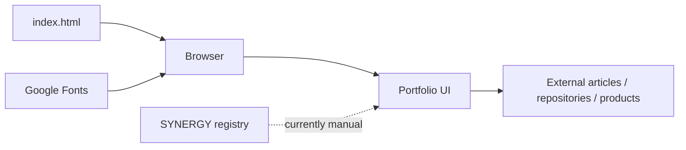
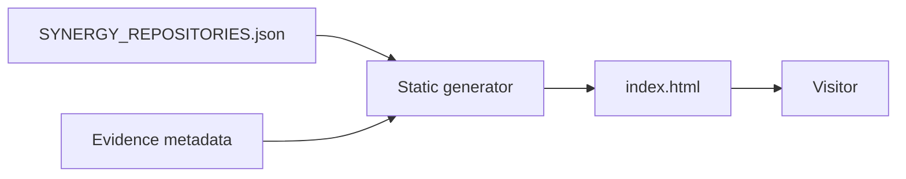

# 🌐 Shtenco Projects Portal — verified technical dossier

> **Статус:** 🟡 CANDIDATE public presentation surface.
> **Проверено по фактическому `main`:** 29.09.2026.
> **Роль:** публичный portfolio / navigation portal, а не runtime authority.

## 1. 🎯 Назначение

`shtenco.github.io` — публичная статическая витрина проектов, статей, продуктов и направлений Quant / AI / Web3 / Blockchain.

Архитектурная задача портала — дать человеку удобную навигацию и presentation context, при этом не превращать копию текста на сайте в второй источник истины о:

- состоянии кода;
- performance;
- production deployment;
- финансовых результатах;
- зрелости federation.

Главная граница:

```text
portfolio copy
!=
repository evidence
!=
runtime status
!=
audited performance
```

## 2. 📦 Фактическое дерево `main`

```text
shtenco.github.io/
├── README.md
└── index.html
```

`index.html` — крупный single-file static portal размером около 133 KB.

На текущем `main` нет:

- build pipeline;
- CI;
- tests;
- backend;
- API;
- generated project registry;
- claims evidence manifest.

## 3. 🖥️ Реально реализованные части

По `index.html` подтверждены:

- responsive portfolio UI;
- RU/EN переключение;
- CSS-only language state для части интерфейса;
- animated background / scan / reveal layers;
- portfolio navigation;
- секции offer, evolution, MQL5 articles, investments, products, contacts;
- external links;
- external Google Fonts;
- mobile/tablet layout rules;
- article cards and category navigation.

Это реальная презентационная реализация. Она не доказывает состояние связанных проектов.

## 4. 🏗️ Архитектура текущего repo



Сейчас содержимое портала поддерживается в HTML вручную. Поэтому возможен drift относительно federation registry.

## 5. 📥 Inputs

Текущий static runtime получает:

- HTML/CSS/JS из repository;
- browser events;
- language radio state;
- viewport/scroll/mouse events;
- Google Fonts;
- переходы по external links.

Нет server-side data source или live federation API.

## 6. 📤 Outputs

- rendered public portfolio;
- RU/EN presentation;
- navigation to articles/projects;
- static metrics/descriptions;
- client-side animation state.

Ни один из этих outputs не является authoritative state других repository.

## 7. 🧠 Content model

В одной HTML-странице совмещены:

```text
identity / positioning
editorial proposal
career/evolution narrative
article catalog
investment content
product links
project descriptions
contact/navigation
```

Для небольшого сайта это работает, но при ~133 KB single-file structure review и synchronization становятся всё сложнее.

## 8. 🛡️ Authority boundaries

```text
displayed project status != registry status
portfolio metric         != measured evidence
article description      != benchmark
marketing claim          != engineering proof
client-side language     != source-of-truth content model
external link            != maintained dependency
```

Portal имеет право **ссылаться** на evidence, но не создавать его самим фактом отображения.

## 9. ⚠️ Drift model

Главный технический риск этого repository — не вычислительная ошибка, а stale presentation.

Пример потенциального drift:

```text
project repository changes
        ↓
registry changes
        ↓
portfolio HTML remains old
        ↓
public statement != current evidence
```

Поэтому следующий уровень — генерировать project/status blocks из machine-readable registry.

## 10. 🔐 Security / privacy

Так как repo публичный и статический:

- нельзя помещать secrets/API keys;
- нельзя хранить broker credentials;
- нельзя хранить private investor/customer data;
- любые contact integrations требуют отдельной privacy boundary;
- external scripts/resources должны быть минимизированы;
- ссылки с `target=_blank` должны сохранять безопасный `rel` policy;
- CSP должна быть определена при росте внешних ресурсов.

В текущем HTML используются внешние Google Fonts — это отдельная network dependency.

## 11. ♿ Accessibility / UX gates

Для verified presentation artifact нужны:

- semantic HTML audit;
- keyboard navigation;
- focus visibility;
- language semantics;
- contrast;
- reduced-motion behavior;
- mobile responsiveness;
- link labels;
- headings hierarchy.

В CSS уже присутствует `prefers-reduced-motion` handling для части motion layer — хороший базовый элемент, но это не заменяет полный accessibility audit.

## 12. 🧪 Required automated checks

### Static correctness

- HTML validation;
- CSS parse smoke;
- internal anchors;
- broken external links;
- missing assets;
- duplicate ids.

### Presentation integrity

- RU/EN parity;
- project list vs federation registry;
- stale status detection;
- claim-to-evidence link check;
- article URL health.

### Security

- secret scan;
- unsafe inline external script scan;
- CSP report;
- external dependency inventory.

### Visual

- desktop screenshot;
- mobile screenshot;
- no-overflow smoke;
- reduced-motion smoke.

## 13. 📊 Claim-to-evidence discipline

Любая сильная метрика на портале должна иметь machine-readable classification:

```text
MEASURED
BACKTEST
TARGET
ESTIMATE
HISTORICAL
THIRD_PARTY
ROADMAP
UNVERIFIED_PRESENTATION
```

И, если применимо:

```text
source_repository
evidence_path
commit_sha
verified_at
```

Так сайт перестанет быть ручной копией status.

## 14. 🛠️ Воспроизводимость

Локальный запуск:

```bash
git clone https://github.com/Shtenco/shtenco.github.io.git
cd shtenco.github.io
python -m http.server 8000
```

Открыть localhost:8000.

Так как это static single-file portal, отдельная compilation stage сейчас не требуется.

## 15. 🗺️ Карта репозитория

| Путь | Роль |
|---|---|
| `index.html` | public portfolio UI, CSS, content and client JS |
| `README.md` | verified technical dossier |
| `.github/workflows/` | ❌ отсутствует |
| `tests/` | ❌ отсутствует |
| `data/projects.json` | ❌ отсутствует |
| `claims.json` | ❌ отсутствует |
| backend | ❌ отсутствует |

## 16. 🔗 Место в SYNERGY

Portal является presentation-layer и должен получать status/navigation из:

- [`synergy_system`](https://github.com/Shtenco/synergy_system);
- [75-repository atlas](https://github.com/Shtenco/synergy_system/blob/main/docs/SYNERGY_REPOSITORY_ATLAS.md);
- [machine-readable registry](https://github.com/Shtenco/synergy_system/blob/main/registry/SYNERGY_REPOSITORIES.json).

Целевая схема:



## 17. 📊 Evidence maturity

| Layer | Status |
|---|---|
| static portal implementation | ✅ |
| RU/EN presentation | ✅ |
| responsive/motion UI | ✅ |
| project/article navigation | ✅ |
| automated build/test | ❌ |
| registry-driven generation | ❌ |
| claim evidence binding | ❌ |
| backend | not applicable / ❌ |
| authoritative project status | resides elsewhere |

## 18. 🚀 Roadmap

1. вынести project metadata из HTML;
2. генерировать project list из federation registry;
3. добавить claims/evidence manifest;
4. добавить CI HTML/link/secret checks;
5. добавить RU/EN parity test;
6. screenshot regression;
7. accessibility audit;
8. CSP/external-resource policy;
9. `last_verified` для project status;
10. автоматический drift gate против `synergy_system`.

## 19. 🛑 Что portal НЕ утверждает сам по себе

- production readiness любого связанного проекта;
- фактическую доходность trading systems;
- correctness AI models;
- deployed blockchain state;
- audited investment metrics;
- актуальность вручную вписанной цифры без evidence link.

## 20. ✅ Definition of Done для verified portal

```text
static source
+ registry-driven project data
+ claim-to-evidence mapping
+ link checks
+ accessibility smoke
+ RU/EN parity
+ secret scan
+ screenshot regression
+ drift CI
= VERIFIED PRESENTATION SURFACE
```

---

[🧭 SYNERGY SYSTEM](https://github.com/Shtenco/synergy_system) · [📚 Атлас 75 репозиториев](https://github.com/Shtenco/synergy_system/blob/main/docs/SYNERGY_REPOSITORY_ATLAS.md) · [🧾 Registry](https://github.com/Shtenco/synergy_system/blob/main/registry/SYNERGY_REPOSITORIES.json)
