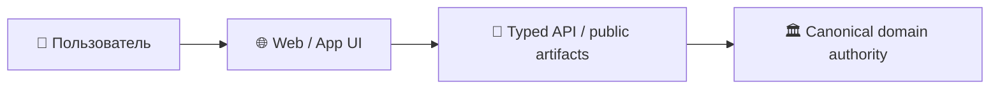
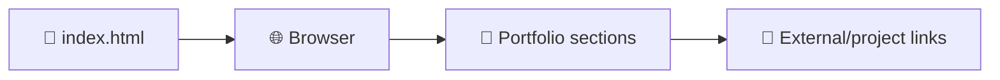

# 🌐 Shtenco Projects Portal

> **Роль:** Публичная GitHub Pages-витрина проектов Shtenco/SYNERGY.  
> **Архитектурный родитель:** [`synergy_apps`](https://github.com/Shtenco/synergy_apps)

## 🎯 Назначение

Публичная GitHub Pages-витрина проектов Shtenco/SYNERGY.

Этот репозиторий относится к presentation/application слою. Он не должен становиться вторым бухгалтерским ledger, платёжным authority или источником истины для backend-состояния.



## 🛡️ Инварианты

```text
UI state            != accounting truth
static page         != backend runtime
displayed metric    != audited metric
client-side success != settlement
```

## 🔗 Федерация

- [SYNERGY SYSTEM](https://github.com/Shtenco/synergy_system)
- [SYNERGY Apps](https://github.com/Shtenco/synergy_apps)
- [Атлас всех 75 репозиториев](https://github.com/Shtenco/synergy_system/blob/main/docs/SYNERGY_REPOSITORY_ATLAS.md)
- [Машиночитаемый реестр](https://github.com/Shtenco/synergy_system/blob/main/registry/SYNERGY_REPOSITORIES.json)

## 🚀 Roadmap документации

- [ ] описать фактическую структуру сайта/приложения;
- [ ] добавить data-flow diagram;
- [ ] зафиксировать источники публичных данных;
- [ ] добавить privacy/security notes;
- [ ] автоматизировать проверку битых ссылок;
- [ ] связывать claims с evidence artifacts.


---

# 🌐 Глубокий технический паспорт портала

## Фактический `main`

```text
README.md
index.html
```

`index.html` — самостоятельный статический RU/EN-портал-портфолио с секциями Quant / AI / Web3 / Blockchain, встроенными стилями, motion-layer, карточками проектов и публичными метриками/описаниями.



## Ключевая граница доказательности

Любые числа, статусы проектов и performance-claims, отображаемые в статическом HTML, являются **presentation content** до тех пор, пока не имеют прямой ссылки на воспроизводимый evidence artifact соответствующего репозитория.

## Технические риски

- один большой HTML одновременно содержит контент, стили и JS;
- внешние Google Fonts — внешняя runtime dependency;
- нет отдельного test/build pipeline;
- статическая копия метрик может устареть относительно 75-repo registry;
- portal copy не должна становиться вторым источником истины.

## Следующий рубеж

1. генерировать список проектов из `SYNERGY_REPOSITORIES.json`;
2. вынести claims в structured data с evidence URLs;
3. добавить link checker;
4. добавить accessibility/HTML validation;
5. показывать `last_verified` для числовых claims.
