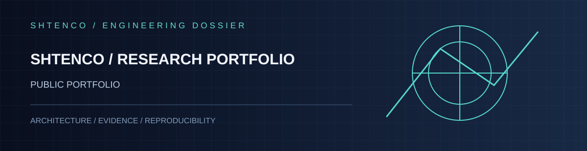
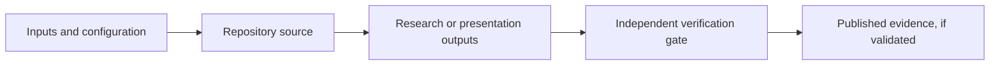

<div align="center">



**Static portfolio and project index**

[Architecture](#architecture) · [Repository map](#repository-map) · [Run](#getting-started) · [Validation](#validation-and-evidence) · [Roadmap](#engineering-roadmap)

</div>

> **Evidence status: PUBLIC PORTFOLIO.** This README describes repository contents and boundaries, not verified production readiness or investment outcomes. Previous narrative is preserved in [legacy documentation](docs/README_LEGACY.md) for traceability, not as independent proof.

## Overview

Static portfolio and project index. The purpose is to provide a research and engineering basis that can be inspected and improved without implying performance that has not been independently validated.

| Field | Details |
|:--|:--|
| Repository | [`shtenco.github.io`](https://github.com/Shtenco/shtenco.github.io) |
| Primary stack | Static HTML, CSS, JavaScript, project JSON files |
| Role | PUBLIC PORTFOLIO |
| Source of truth | Code on `main`; experiments require separate reproducible artifacts |
| Parent ecosystem | [SYNERGY SYSTEM](https://github.com/Shtenco/synergy_system) |

## Architecture


```mermaid
flowchart LR
 A[Inputs and configuration] --> B[Repository source]
 B --> C[Research or presentation outputs]
 C --> D[Independent verification gate]
 D --> E[Published evidence, if validated]
```

**Implementation scope:** Static portfolio and project index. The diagram is a conceptual map and does not assert that the verification gate is implemented or automated.

## Repository map

| Path | Purpose |
|:--|:--|
| `index.html` | Website/page source |
| `original-source.html` | Website/page source |
| `assets/` | Website assets or data |
| `data/` | Website assets or data |
| `_data/` | Website assets or data |
| `docs/README_LEGACY.md` | Preserved historical documentation; claims may be unverified |
| `assets/readme/hero.svg` | Vector cover, with no external image-host dependencies |

## Getting started

Check required Python modules, vendor platform services and API keys before execution. **Commands below identify the source entry point; they are not evidence of a successful run in this session.**

```bash
git clone https://github.com/Shtenco/shtenco.github.io.git
cd shtenco.github.io
python -m http.server 8000
```

Open http://localhost:8000 in a browser. The site is static.

## Validation and evidence

**Known limitation:** No backend or authoritative verification of third-party or linked repository results.

| Layer | Evidence classification |
|:--|:--|
| Source files | Present in repository tree |
| Automated tests and CI | Not established by this documentation pass |
| Out-of-sample or independent evaluation | Not established by this documentation pass |
| Production readiness | Not established |
| Economic or predictive claims | Must be supported by dated, reproducible evidence |

The terms *prototype*, *simulation*, *backtest*, *live deployment* and *audited result* should never be conflated. Any quoted return, accuracy, latency or capability must be tied to a data provenance record, experiment conditions and a commit.

## Engineering roadmap

Project registry consistency, content validation, link checking, mobile accessibility.

Recommended completion criteria: testable experiment configuration, pinned runtime dependencies, repeatable CI or equivalent checks, archived output manifests, and a documented failure/limitations section.

## Maintainer and attribution

Maintained in the [Shtenco GitHub portfolio](https://github.com/Shtenco). See `LICENSE` for applicable terms. Read the original repository source and [legacy README](docs/README_LEGACY.md) before treating earlier examples or statistics as verified evidence.
